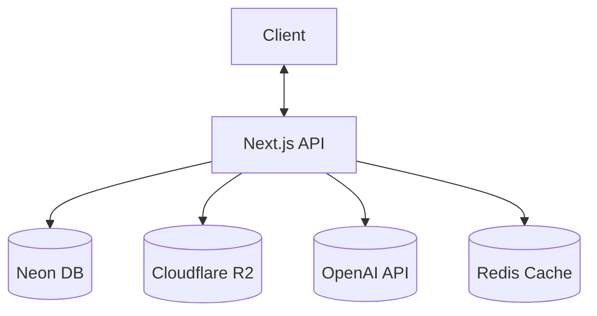
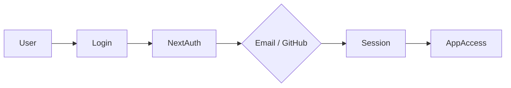
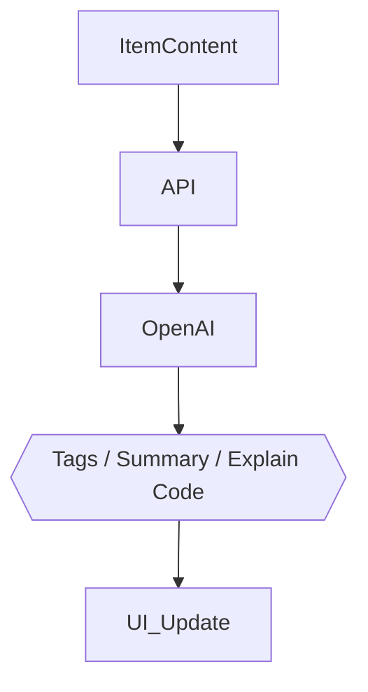

# 🏗️ DevStash — Project Overview

> **Store Smarter. Build Faster.**
> A centralized, AI-enhanced developer knowledge hub for snippets, prompts, docs, commands & more.

---

## 📌 Problem

Developers keep their essentials scattered across too many tools:

- 💻 Code snippets in VS Code or Notion
- 🤖 AI prompts buried in chat history
- 📄 Context files lost inside random projects
- 🔖 Useful links in browser bookmarks
- 📚 Docs in random folders
- ⌨️ Commands saved in `.txt` files
- 🧩 Project templates scattered across GitHub gists
- 🖥️ Terminal commands lost in bash history

This creates **constant context switching**, **lost knowledge**, and **inconsistent workflows**.

➡️ **DevStash provides ONE searchable, AI-enhanced hub for all dev knowledge & resources.**

---

## 🧑‍💻 Target Users

| Persona | Needs |
|---|---|
| 👨‍💻 Everyday Developer | Quick access to snippets, commands, links |
| 🤖 AI-First Developer | Store prompts, workflows, contexts |
| 🎓 Content Creator / Educator | Save course notes, reusable code |
| 🏗️ Full-Stack Builder | Patterns, boilerplates, API references |

---

## ✨ Core Features

### A) Items & System Item Types

Every item belongs to one of the built-in types:

| Type | Description |
|---|---|
| 📝 Snippet | Reusable code blocks |
| 🤖 Prompt | AI prompts & workflows |
| 🗒️ Note | Freeform markdown notes |
| ⌨️ Command | CLI / terminal commands |
| 📁 File | Uploaded documents/templates |
| 🖼️ Image | Uploaded images |
| 🔗 URL | Saved links/bookmarks |

> **Custom types** are available for Pro users.

### B) Collections

Group items together — mixed item types allowed within a single collection.

**Examples:** `React Patterns` · `Context Files` · `Python Snippets`

### C) Search

Full-text search across:

- Content
- Tags
- Titles
- Types

### D) Authentication

- Email + Password
- GitHub OAuth

### E) Additional Features

- ⭐ Favorites & pinned items
- 🕓 Recently used
- 📥 Import from files
- ✍️ Markdown editor for text items
- 📎 File uploads (images, docs, templates)
- 📤 Export (JSON / ZIP)
- 🌙 Dark mode (default)

### F) AI Superpowers

- 🏷️ Auto-tagging
- 📄 AI summaries
- 🧠 Explain Code
- ⚡ Prompt optimization

> AI powered by **OpenAI `gpt-5-nano`**

---

## 🗄️ Data Model (Prisma Draft)

> This schema is a starting point and **will evolve**.

```prisma
model User {
  id                   String       @id @default(cuid())
  email                String       @unique
  password             String?
  isPro                Boolean      @default(false)
  stripeCustomerId     String?
  stripeSubscriptionId String?

  items                Item[]
  itemTypes            ItemType[]
  collections          Collection[]
  tags                 Tag[]

  createdAt            DateTime     @default(now())
  updatedAt            DateTime     @updatedAt
}

model Item {
  id           String   @id @default(cuid())
  title        String
  contentType  String   // "text" | "file"
  content      String?  // used for text-based types
  fileUrl      String?
  fileName     String?
  fileSize     Int?
  url          String?
  description  String?
  isFavorite   Boolean  @default(false)
  isPinned     Boolean  @default(false)
  language     String?

  userId       String
  user         User        @relation(fields: [userId], references: [id])

  typeId       String
  type         ItemType    @relation(fields: [typeId], references: [id])

  collectionId String?
  collection   Collection? @relation(fields: [collectionId], references: [id])

  tags         ItemTag[]

  createdAt    DateTime @default(now())
  updatedAt    DateTime @updatedAt
}

model ItemType {
  id       String   @id @default(cuid())
  name     String
  icon     String?
  color    String?
  isSystem Boolean  @default(false)

  userId   String?
  user     User?    @relation(fields: [userId], references: [id])

  items    Item[]
}

model Collection {
  id          String   @id @default(cuid())
  name        String
  description String?
  isFavorite  Boolean  @default(false)

  userId      String
  user        User     @relation(fields: [userId], references: [id])

  items       Item[]

  createdAt   DateTime @default(now())
  updatedAt   DateTime @updatedAt
}

model Tag {
  id     String    @id @default(cuid())
  name   String
  userId String
  user   User      @relation(fields: [userId], references: [id])

  items  ItemTag[]
}

model ItemTag {
  itemId String
  tagId  String

  item Item @relation(fields: [itemId], references: [id])
  tag  Tag  @relation(fields: [tagId], references: [id])

  @@id([itemId, tagId])
}
```

---

## 🧱 Tech Stack

| Category | Choice |
|---|---|
| Framework | **Next.js (React 19)** |
| Language | TypeScript |
| Database | Neon PostgreSQL + Prisma ORM |
| Caching | Redis *(optional)* |
| File Storage | Cloudflare R2 |
| CSS / UI | Tailwind CSS v4 + ShadCN |
| Auth | NextAuth v5 (Email + GitHub) |
| AI | OpenAI `gpt-5-nano` |
| Deployment | Vercel *(likely)* |
| Monitoring | Sentry *(later)* |

---

## 💰 Monetization

| Plan | Price | Limits | Features |
|---|---|---|---|
| **Free** | $0 | 50 items, 3 collections | Basic search, image uploads, no AI |
| **Pro** | $8/mo or $72/yr | Unlimited | File uploads, custom types, AI features, export |

> Stripe for subscriptions + webhooks for syncing.

---

## 🎨 UI / UX

- Dark mode first
- Minimal, developer-friendly UI
- Syntax highlighting for code
- Inspired by **Notion**, **Linear**, **Raycast**

**Layout**
- Collapsible sidebar with filters & collections
- Main grid/list workspace
- Full-screen item editor

**Responsive**
- Mobile drawer for sidebar
- Touch-optimized icons and buttons

---

## 🔌 API Architecture



---

## 🔐 Auth Flow



---

## 🧠 AI Feature Flow



---

## 🗂️ Development Workflow (For Course)

- One branch per lesson (students can follow & compare)
- Use **Cursor / Claude Code / ChatGPT** for assistance
- Sentry for runtime monitoring & error tracking
- GitHub Actions *(optional for CI)*

**Branch naming example:**

```bash
git switch -c lesson-01-setup
```

---

## 🧭 Roadmap

### MVP
- [ ] Items CRUD
- [ ] Collections
- [ ] Search
- [ ] Basic tags
- [ ] Free tier limits

### Pro Phase
- [ ] AI features
- [ ] Custom item types
- [ ] File uploads
- [ ] Export
- [ ] Billing & upgrade flow

### Future Enhancements
- [ ] Shared collections
- [ ] Team/Org plans
- [ ] VS Code extension
- [ ] Browser extension
- [ ] API + CLI tool

---

## ✅ Next Steps

1. **Lock the data model** — finalize the Prisma schema above (esp. `Item.contentType` handling and tag relations) before writing migrations.
2. **Set up the environment** — Next.js 19 project scaffold, Neon Postgres instance, Prisma migrations, Tailwind v4 + ShadCN install.
3. **Configure auth** — NextAuth v5 with Email + GitHub providers; define session/user model tie-in.
4. **Build MVP CRUD** — Items, Collections, and basic tag/search endpoints (start with Postgres full-text search before considering a dedicated search service).
5. **Wire up file storage** — Cloudflare R2 bucket + signed upload URLs for File/Image item types.
6. **Ship the core UI** — sidebar + grid/list workspace + full-screen editor, dark mode by default.
7. **Add Stripe billing** — Free vs Pro plan gating, webhook sync for subscription status.
8. **Layer in AI features** — auto-tagging, summaries, explain-code, prompt optimization via `gpt-5-nano`.
9. **Instrument monitoring** — add Sentry once the MVP is live.
10. **Plan the course structure** — map each roadmap milestone to a lesson branch (`lesson-01-setup`, `lesson-02-auth`, etc.).

---

## 📌 Status

**In planning** — ready for environment setup & UI scaffolding.

---

🏗️ **DevStash — Store Smarter. Build Faster.**
